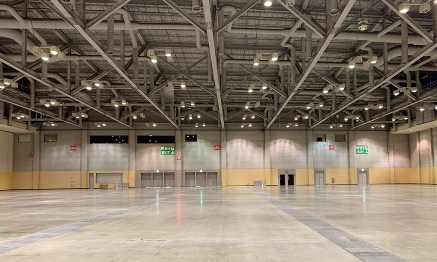

*Last Updated: 2026-01-29*

**Table of content**
- ToC
{:toc}

# 1. Overview

The International ROBORACER Autonomous Racing Competition is a racing event open to teams of all levels. Teams may consist of any number of members; however, each participant must be **a member of only one team**.

This competition will be held as an in-person competition from **August 24 (Monday)** to **August 27 (Thursday)**, **2026**, at **BEXCO** in Busan during **IFAC 2026**.

**ROBORACER GRAND PRIX Schedule: August 24 (Monday) to 27 (Thursday), 2026**

Teams may **register** for the competition through the **official website**.

# 2. Competition General

1. The competition consists of five phases:
   - **Phase 0**: Submission of technical materials related to the team's autonomous driving
   - **Phase 1**: Registration and inspection
   - **Phase 2**: Mapping and practice sessions (mapping, official practice, free practice)
   - **Phase 3**: Qualification (Mission Execution, Time Trial)
   - **Phase 4**: Head-to-Head Race

2. Teams registered for in-person competition must provide and build their own vehicles according to the constraints listed below. In addition, each team must have a unique vehicle (i.e., one lab cannot enter multiple teams with a single vehicle).

3. To improve the quality of future ROBORACER competitions, winners of each race are encouraged to open-source their algorithm code under an open-source license in the [ROBORACER Autonomous Racing Community repository](https://github.com/f1tenth) on GitHub.

## 2.0 Technical Materials Submission

1. Teams shall submit technical materials regarding their vehicle during the pre-competition registration process.

2. No specific format is required.

3. The submission must include a summary of the **software and hardware technology** of the team's autonomous vehicle.

4. Please observe the deadline.

## 2.1 Vehicle Class
**Vehicle Class** only allows vehicles that meet the following constraints:

1. Vehicles must be built according to ROBORACER guidelines, but alternative parts may be allowed as long as they comply with regulations. Unclear or ambiguous items must be confirmed in advance with race organizers.
2. Each vehicle is inspected as part of qualifying to determine if it meets criteria. If criteria are not met, the vehicle cannot participate.
3. **The ROBORACER competition is an algorithm competition. Hardware that confers an advantage is not permitted.**
4. _Chassis_:
    The race is designed for **1:10 Traxxas** chassis (e.g., TRA74054, TRA6804R). While these chassis are recommended, chassis generally within 15% of Traxxas vehicle dimensions are allowed (238mm <= width <= 341mm, 454mm <= length <= 654mm). Both **4WD and 2WD** are allowed.
5. _Tires_:
    **No restriction** (both sponge and rubber are permitted). However, **chemical additives are strictly prohibited**.
6. _Main computing unit_:
    **No restriction** on specifications. Only one computing unit may be used.
7. _LiDAR_:
    **No restriction** on specifications. Only one LiDAR sensor may be used. **3D LiDAR** is also permitted.
8. _Camera_:
    Both a **single camera** (e.g., Logitech C270, Logitech C920, Raspberry Pi Camera Module V2, Arducam) and a **stereo camera** (e.g., Intel Realsense, ZED) are permitted. Cameras that provide additional information via onboard processing, such as **detection or VIO results**, are **not permitted**. (Depth information is allowed.)
9. _Motor_:
    **No restriction** on specifications. Only a **single motor** may be used for the powertrain.
10. _Battery_:
    **4S LiPo battery** or **3S or lower**. Only one 4S battery or a lower-cell combination is allowed (e.g., 2S + 2S is allowed).
11. _Detection box_:
    The vehicle must be easily detected by the opponent's LiDAR. Therefore, the vehicle must occupy a space of at least **12 x 12 cm** in any horizontal plane between **10 and 30 cm** above the ground.
12. _Foam bumper_:
    The bumper must be soft to minimize damage. If two or more vehicles are on the track, these two components (Detection box and foam bumper) must be attached.
13. _Other sensors_:
    Other sensors (IMU, encoders, custom electronic speed controllers) are allowed. Indoor GPS sensors (e.g., Marvelmind) are **not allowed**.

## 2.2 Track and Race Environment

The competition will be held at BEXCO in Busan. The characteristics of the environment in which the track will be constructed are as follows:

The floor of [BEXCO Exhibition Hall 1](https://www.bexco.co.kr/eng/CMS/Contents/Contents.do?mCode=MN039), where the track will be installed, is hardened concrete with a urethane coating finish. This surface is characterized by a significantly lower friction coefficient compared to typical asphalt pavement and is notably smooth.

## 2.3 Inspection

- The purpose of inspection is to verify that the hardware of the autonomous vehicle meets competition requirements and does not pose a risk to the environment, opponents, or people.

- Vehicles must be built according to ROBORACER guidelines, but alternative parts may be allowed as long as they comply with regulations.

- Teams must demonstrate that they can activate the emergency brake via a toggle method (however, **this may not be used for intervention during the race**!).

- Vehicle inspection will be conducted on the first day of the competition.

- Inspections are performed by the race referees.

- Inspection must be completed **before the Time Trial** and **after any significant changes** to the vehicle's hardware or algorithm.

## 2.4 Mapping and Practice

### 2.4.1 Mapping
- Approximately 3 minutes are allocated to each team.
- This time is exclusive use of the entire track for a single team.
- This time may be used for mapping, data collection, and practice.
- If a team does not arrive at its designated time slot, the opportunity is forfeited and no additional time will be provided.
- Each team may prepare multiple vehicles and use them on the track.
- Teams without a map file may obtain one from nearby teams, but this is outside the responsibility of the organizers.
- For this competition, png and yaml files for the track will be provided.

### 2.4.2 Practice
- Each team may prepare multiple vehicles, but only one vehicle per team may be on the track.
- Sample obstacles will be provided.
- The organizers do not assume responsibility for accidents during practice.
- However, the team involved in an accident is obligated to explain its algorithm at the request of the referees.

## 2.5 Pit Stop

### 2.5.1 General
- This zone is designated for adjusting parameters **without removing the vehicle from the track**.
- This zone may be used in both qualifying and the Head-to-Head Race.
- When the vehicle is in the pit stop zone, vehicle hardware repair and parameter tuning are allowed without penalty.
- As with the main track, standing in this zone is prohibited.
- Additionally, after safely entering this zone, removing the vehicle to the island for repair does not constitute a warning.
- Fully intruding into this zone during autonomous racing is subject to penalty.

### 2.5.1 Entry
- Manual driving may be used only to enter the pit stop zone from the **manual driving zone**.
- During the Head-to-Head Race, manual driving to enter the pit must **not cause harm to the opposing vehicle**.

### 2.5.2 Exit
- When exiting the pit stop zone to the normal driving area, do **not** use manual driving in any manner.
- A vehicle exiting the pit stop zone has a duty to protect vehicles in the normal driving area.

## 2.6 Qualification (Mission Execution, Time Trial)
<!-- 

 -->
<!--needs update-->
### 2.6.1 General
- Practice and qualifying use the same track.
- All stages of qualifying must be completed **within 8 minutes**.
    - This may change depending on the total number of participating teams.
- Qualifying consists of **three missions** and **one achievement condition**, referred to as Q1, Q2, Q3, and Q4 in order.
- Q1 through Q3 are conducted sequentially and may not be skipped.
- Final ranking in qualifying is determined in the following order:
    - Completion of Q4
    - Number of qualifying rounds passed
    - Record of the most recently completed qualifying round
- An example of final ranking determination is as follows:
    - Assume there are 12 teams in total.
    - Assume that 3 teams pass each of Q1, Q2, Q3, and Q4.
    - Among teams that pass Q4, assign places 1 through 3 in order of Q3 record.
    - Among teams that pass Q3, assign places 4 through 6 in order of Q3 record.
    - Repeat in the same manner down to Q1.

#### 2.6.1.1 Qualification Example

<table>
  <thead>
    <tr>
      <th>Rank</th>
      <th>Q4 (Fully Autonomous)</th>
      <th>Q3 (fastest lap)</th>
      <th>Q2 (laps completed)</th>
      <th>Q1 (laps completed)</th>
    </tr>
  </thead>
  <tbody>
    <tr><td>1</td><td>O</td><td>10.8 s</td><td>3</td><td>2</td></tr>
    <tr><td>2</td><td>O</td><td>11.2 s</td><td>3</td><td>2</td></tr>
    <tr><td>3</td><td>O</td><td>13.0 s</td><td>3</td><td>2</td></tr>
    <tr><td>4</td><td>X</td><td>9.9 s</td><td>3</td><td>2</td></tr>
    <tr><td>5</td><td>X</td><td>10.1 s</td><td>3</td><td>2</td></tr>
    <tr><td>6</td><td>X</td><td>12.2 s</td><td>3</td><td>2</td></tr>
    <tr><td>7</td><td>X</td><td>13.2 s</td><td>3</td><td>2</td></tr>
    <tr><td>8</td><td>X</td><td>-</td><td>2</td><td>2</td></tr>
    <tr><td>8</td><td>X</td><td>-</td><td>2</td><td>2</td></tr>
    <tr><td>10</td><td>X</td><td>-</td><td>1</td><td>2</td></tr>
    <tr><td>11</td><td>X</td><td>-</td><td>0</td><td>2</td></tr>
    <tr><td>12</td><td>X</td><td>-</td><td>0</td><td>1</td></tr>
    <tr><td>13</td><td>X</td><td>-</td><td>0</td><td>0</td></tr>
    <tr><td>13</td><td>X</td><td>-</td><td>0</td><td>0</td></tr>
  </tbody>
</table>

### 2.6.2 Qualifying 1 (Q1)
- The objective of Q1 is to complete **two laps** of the track **without collisions**.
- Vehicles that do not pass Q1 are ranked by the number of collision-free laps completed.
- Vehicles that pass Q1 advance to Q2.

### 2.6.3 Qualifying 2 (Q2)
- The objective of Q2 is to complete **three laps** **without collisions** in the presence of **random obstacles**.
- Random obstacles for Q2 are placed by referees, with a total of **two** obstacles. Obstacle locations are not announced in advance.
- Vehicles that do not pass Q2 are ranked by the number of collision-free laps completed.
- Vehicles that pass Q2 advance to Q3.

### 2.6.4 Qualifying 3 (Q3)
- The objective of Q3 is to achieve the **minimum lap time** over two minutes on a track without obstacles.
- The shortest lap time during the two minutes is used as the record.

### 2.6.5 Qualifying 4 (Q4)
- Q4 is an achievement condition.
- The achievement condition applies at all moments during qualifying.
- The achievement condition is as follows:
    - **Teams that do not directly or indirectly affect the vehicle throughout the entire qualifying process**
- Direct or indirect influence is defined as follows:
    - Touching the vehicle
    - Operating a joystick
    - Touching the keyboard/mouse
    - Operating a computer
    - For complete achievement, the following poses are recommended:

  
  

### 2.6.6 Static Obstacles
- The randomly placed obstacles during Q2 are static obstacles.
- Each obstacle is smaller than 0.5m x 0.5m.
- Obstacle locations are randomly placed by referees after Q1 is completed.
- Obstacles are removed after Q2 is completed.
- Obstacles are removed safely when the vehicle is not affected.

### 2.6.7 Invalid Records
- If a human intervenes and affects the vehicle, the **lap time is invalidated** and **excluded from the number of completed laps**.
- If there is contact with a static obstacle, the **lap time is invalidated** and **excluded from the number of completed laps**.
- If there is contact with the track but the vehicle can drive without human intervention, it is considered minor contact and the record remains valid.

### 2.6.8 Notes
- Moving a vehicle to an **arbitrary location (e.g., the start line)** during qualifying is **strictly prohibited**.
- If a vehicle is removed from the track and then reinserted, the vehicle's orientation may be adjusted slightly, but it must be placed back at the **same location** from which it was removed.
- If there is contact with the track, even if the record is not invalidated, the track must be **immediately returned to its original position**.
- If there is contact with an obstacle, it must be immediately returned to its original position.
- **All computation must be performed on the vehicle!!**
- **Data must not be transmitted to the vehicle during normal driving.**
- **Manual (human) emergency braking is strictly prohibited during normal driving.**
- There are two islands within the track area, and one island may have two people.
    - The island composition will be as follows: (Referee 1, Team Member 1 in Team 1), (Referee 2, Team Member 2 in Team 1)

## 2.7 Head-to-Head Race
<!-- 

 -->
<!--needs update-->
### 2.7.1 General
- The two vehicles start from different start lines located in opposite directions.
- A total of three static obstacles are used. After all teams are ready to race, each participating team places one obstacle, and the referees place the remaining obstacle.
- Static obstacles on the track are removed when the leading vehicle has completed 10 laps.
- Each vehicle must complete 20 laps first within the time limit while avoiding obstacles and the opposing vehicle.

### 2.7.2 Objective
- Complete 20 laps first.
Races before the quarterfinals may be modified to 10 laps.

### 2.7.3 Random Static Obstacles
- A total of three **static obstacles** are randomly placed.
- Each participating team and the referees place one static obstacle each.
- Each obstacle is smaller than 0.5m x 0.5m.
- Obstacle locations are placed after both vehicles have completed preparations at the start lines.
- After obstacles are placed, only the start signal may be transmitted to the vehicles.
- **Obstacles are removed during the race.**
- Obstacles are removed safely when neither vehicle is affected.

### 2.7.4 Collision
- Track boundaries and static obstacles
    - Restore the track and obstacles.
    - If the race can continue, it must continue without interruption.
- Vehicle-to-vehicle
    - **Do not stop the race at the team's discretion without the referees' stop signal!!**
    - If the at-fault vehicle is clear but no overtake has occurred, the race continues.
    - If the victim vehicle is clearly identified and the victim vehicle is unable to drive, the collision is severe, or the victim vehicle is overtaken, the race is stopped.

### 2.7.5 Notes
- **Do not stop the race at the team's discretion without the referees' stop signal!!**
- **All computation must be performed on the vehicle!!**
- **Data must not be transmitted to the vehicle during normal driving.**
- **Manual (human) emergency braking is strictly prohibited during normal driving.**
- A vehicle that violates the Detection box regulation may not participate in the race.
- There are two islands within the track area, and one island may have two people.
    - The island composition will be as follows: (Referee 1, Team Member in Team 1), (Referee 2, Team Member in Team 2)
- In side-by-side contact and incidents, if there is no clear at-fault party, the race will not be stopped.

## 2.8 Common Notes (Important!!)
- If a collision makes driving difficult or dangerous, the vehicle must be emergency-stopped immediately.
- **All computation must be performed on the vehicle!!**
- **Data must not be transmitted to the vehicle during normal driving.**
- **Manual (human) emergency braking is strictly prohibited during normal driving.**
- Each team may prepare multiple vehicles, but the only time more than one vehicle from the same team may be on the track is during mapping.
- Sharing a single vehicle across multiple teams is strictly prohibited.
- If two or more vehicles may be on the track, the Detection box must be attached. (e.g., it is not required during mapping or qualifying.)
- **No objections regarding Wi-Fi will be accepted.** Please ensure that your autonomous driving system is designed to operate independently of Wi-Fi conditions. While we will request that non-participating teams turn off Wi-Fi, this is solely to facilitate visualization and debugging for teams, not to improve algorithm performance!
- All hardware repair and maintenance on the track (repairing damaged parts, sensor recalibration, battery replacement, etc.) is prohibited. (Not allowed even in the pit stop area.)
- Dedicated times for **mapping**, **official practice**, and **qualifying** may vary depending on the number of participating teams.
- Dedicated times for **mapping** and **official practice** are assigned on a **first-come, first-served** basis, and only teams that have **successfully completed registration and inspection** are eligible.
- It is prohibited for people to be on the track. (Except during mapping time.)
- Joystick **use** or **pressing** is **not permitted** during the race.
    - Please change the module for switching between autonomous driving and human control from a "**press and hold**" method to an "**on/off**" **toggle** method.
- Only one laptop may be connected for visualization (e.g., RViz) or debugging purposes.
- If a vehicle is stopped too close to the obstacle ahead (opponent vehicle or static obstacle) such that an avoidance maneuver is impossible and space is needed, the referees may move it slightly backward upon request.

# 3. Warnings and Penalties
- **Decisions regarding incidents are at the discretion of the on-site referees and must be respected.**
- **Even if an incident includes multiple violations, only one penalty is applied per incident.**

## 3.1 Qualification
### 3.1.1 One-place Demotion
- Using a keyboard or mouse during the race
    - Keyboard/mouse use is prohibited even if no data transmission occurs
    - Exception 1: When the vehicle is not on the track
    - Exception 2: When the vehicle is in the pit stop zone
    - Exception 3: When sending an initial guess for re-localization
- Interfering with one's own vehicle through manual control (joystick, keyboard, or other device)
    - Exception 1: When the referees declare a race stop and emergency stopping is required
    - Exception 2: When transmitting the start signal at the start or restart
    - Exception 3: When emergency stopping is required due to a collision rendering the vehicle inoperable
    - Exception 4: Manual driving to enter the pit stop zone via the pit-stop manual driving zone
    - Exception 5: When emergency stopping is required after being stuck on an obstacle for more than 5 seconds
    - Exception 6: When emergency stopping is required to prevent abnormal driving (sudden acceleration, reverse driving, etc.)
    - Exception 7: When the opponent vehicle seriously damages the track and the referees permit manual control
    - Exception 8: When stopping after the end of qualifying
- **During the race**, a person directly generates or selects a modified route based on obstacle positions

## 3.2 Head-to-Head Race
### 3.2.1 Disqualification
- If an additional lap is accumulated during the race, reaching a total of 3 additional laps, the team is automatically disqualified.

### 3.2.2 Additional 1 Lap
- When three warnings have accumulated
- **Critical human interference** with the opponent's vehicle during the race
    - When attempting to repair the track and physically contacting the opponent vehicle, affecting its driving
- When there is a clear at-fault and victim vehicle, and the victim vehicle becomes inoperable
- **A severe-impact incident resulting from a complete rear-end collision**
- **A severe-impact incident even if it is not a complete rear-end collision**
- Using a keyboard or mouse during the race
    - Keyboard/mouse use is prohibited even if no data transmission occurs
    - Exception 1: When the vehicle is not on the track
    - Exception 2: When the vehicle is in the pit stop zone
    - Exception 3: When the vehicle has gone off the track, is placed back on the track, and an initial guess is sent for re-localization
- Interfering with one's own vehicle through manual control (joystick, keyboard, or other device)
    - Exception 1: When the referees declare a race stop and emergency stopping is required
    - Exception 2: At start, restart, or after finish
    - Exception 3: When the vehicle is inoperable due to a collision
    - Exception 4: Manual driving to enter the pit stop zone via the pit-stop manual driving zone
    - Exception 5: When emergency stopping is required after being stuck on an obstacle for more than 5 seconds and switching to manual control
    - Exception 6: When emergency stopping is required to prevent abnormal driving (sudden acceleration, reverse driving, etc.)
- **During the race**, a person directly generates or selects a modified route based on obstacle positions

### 3.2.3 One Warning
- False start
- Failure to actively restore the track
- Completely passing through the pit stop zone in autonomous racing mode
- Detection box not properly secured during the race
    - Exception 1: If corrected in the pit stop zone within one lap after the warning
    - A new warning may be issued if it is not properly corrected each lap
- **Intervention** with one's own vehicle during the race
    - Removing the vehicle from the track after a collision
    - Directly correcting the vehicle's heading

- **Interference** with the opponent's vehicle during the race
    - When repairing the track and being detected by the opponent vehicle's detection module, affecting its driving

### 3.2.4 Example Cases

